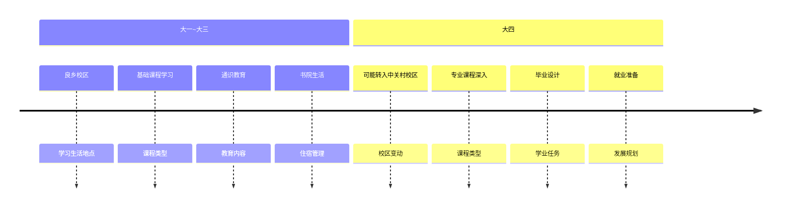

# 🏫 校区介绍

!!! info "概览"
北京理工大学目前有中关村校区（校本部）、良乡校区、西山校区、珠海校区、雄安校区（待建）。

## 🗺️ 校区分布

### 📍 北京地区校区

- **中关村校区**

  - **位置**: 北京市海淀区中关村南大街 5 号
  - **特点**: 校本部，地处核心科教区
  - **周边**: 毗邻国家图书馆、人大、北大清华等
  - **主要功能**: 研究生教育、科研工作

- **良乡校区**

  - **位置**: 北京市房山区良乡高教园区
  - **特点**: 现代化新主校区
  - **主要功能**: 本科生前三年主要学习生活场所
  - **环境**: 校园开阔，环境优美

- **西山校区**

  - **位置**: 北京市海淀区
  - **特点**: 专门功能校区
  - **主要功能**: 特定学科和项目

### 🌊 其他地区校区

- **珠海校区**

  - **位置**: 广东省珠海市
  - **特点**: 南方分校区
  - **主要功能**: 特色专业和国际合作项目

- **雄安校区**

  - **位置**: 河北省雄安新区
  - **状态**: 目前还在计划建设中
  - **意义**: 服务国家雄安新区建设战略

## 🎯 校区功能定位

### 本科生主要学习生活安排

!!! tip "重要提醒"
**大部分本科生前三年都在良乡校区**，这是最重要的信息！

下面的图表展示了本科生在各校区的学习生活安排：

（如上图，您可以直观了解不同年级在各校区的主要活动和安排。）

### 各校区特色对比

| 校区   | 主要人群           | 环境特点           | 交通便利性 | 学术氛围   |
| ------ | ------------------ | ------------------ | ---------- | ---------- |
| 中关村 | 研究生、部分本科生 | 历史悠久、寸土寸金 | ⭐⭐⭐⭐⭐ | ⭐⭐⭐⭐⭐ |
| 良乡   | 本科生为主         | 现代化、环境优美   | ⭐⭐⭐     | ⭐⭐⭐⭐   |
| 西山   | 特定项目           | 相对独立           | ⭐⭐       | ⭐⭐⭐     |
| 珠海   | 特色专业学生       | 海滨城市           | ⭐⭐⭐     | ⭐⭐⭐     |

## 校区介绍

### 良乡校区分区

良乡校区分为东南校区、西南校区（南校区）、西北校区（北校区）、东北校区（东校区），呈田字形分布。

- 南校区最南方是“小南门”，偶尔需人脸识别或校园卡通过闸机。
- 南校区北门极少需刷脸或刷卡，有闸机可通车。
- 东南校区不与外界相连，只通过西边小门通往南校区。
- 北校区南门极少需刷脸刷卡，可通车，南校区与北校区之间有马路和人行天桥“北理桥”相连。
- 北理桥可通自行车、电瓶车和步行。
- 东校区南门通外界，门有坡，骑车注意安全。

## 🚌 校区间交通

### 班车服务

!!! success "便民服务"
学校提供校区间班车服务，可在 i 北理提前一小时进行座位预约，方便快速通行各个校区。

**良乡校区班车停车点：**

- 东校区文萃楼东北路口
- 校医院路口
- 南校区小坦克路口

班车不仅可以作为校区间通勤工具，也可以作为去市中心玩的替代地铁的方式（房山线人多的要死）。

### 其他交通方式

- **地铁**

  - **良乡大学城北站**：距离良乡校区最近，有摆渡车
  - **良乡大学城站**：南校区同学相对较近

- **摆渡车**

  - 在北校区南门、东校区南门和良乡大学城北地铁站有停靠点
  - 意在解决学生的"最后一公里"难题
  - 按时发车，免费乘车

- **自行车/电动车**

  - 校园内可使用共享单车和电瓶车
  - 区分浅蓝色的校内车和深蓝的校外车
  - 只有深蓝色的才能骑到学校外面

## 📈 发展规划

### 历史沿革

- **1940 年**: 延安自然科学院成立
- **1949 年**: 迁至北京，更名北京理工大学
- **2000 年代**: 良乡校区建设启动
- **2020 年代**: 雄安校区规划启动

### 未来展望

!!! abstract "发展愿景"
随着国家战略需求和学校发展规划，北理工将形成"一校多区"的发展格局，各校区功能定位更加明确，资源配置更加优化，为建设世界一流大学提供有力支撑。

---

!!! note "新生提醒"
作为新生，您将在良乡校区开始北理工的求学生涯。这里有完善的教学设施、舒适的生活环境和浓厚的学习氛围，是您实现大学梦想的理想起点！
